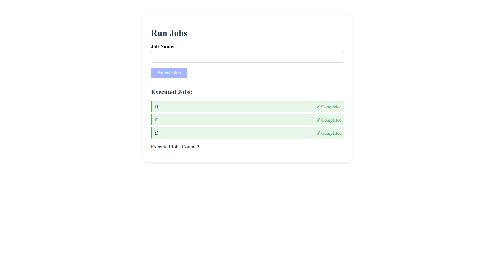

# ⚙️ Async Jub Runner: Java 17 vs. 21 🚀

This project is a **proof of concept** comparing Java 17 and Java 21 in asynchronous task execution, focusing on **response time, scalability, and code elegance**.

---

## 📦 Tech Stack

- **Backend:** Spring Boot (`Java 17` branch) vs. `Java 21` branch
- **Frontend:** Angular 17

---

## ▶️ How to Run the Project

### 🖥 Backend (Spring Boot)

> Java 17 or 21 must be installed — check the correct branch!
>
> This project is using Spring 3.4.3

- Open the project in IntelliJ or VS Code
- Run the `main` class:  
  `com.project.async_scheduler.AsyncSchedulerApplication`

### 🌐 Frontend (Angular)

```bash
cd frontend/
ng serve
```
- Then access: http://localhost:4200



## 🔍 Strategic Comparison: Java 17 vs Java 21

| Criteria                         | ☕ **Java 17** (Current LTS)              | 🚀 **Java 21** (New LTS)                      |
|----------------------------------|------------------------------------------|-----------------------------------------------|
| **Runtime Stability**            | Highly stable and widely supported       | Very stable, with growing adoption            |
| **Modern Features**              | Limited                                   | Virtual Threads, Sequenced Collections, etc.  |
| **Infrastructure Compatibility** | Compatible with most platforms            | May require updates to toolchains/VMs         |
| **Legacy Maintenance**           | Great for backward compatibility          | Less suited to legacy systems                 |
| **Future-readiness**             | Conservative                              | Visionary and scalable by design              |

## 🚀 Why Java 21?

Java 21 is a **game changer** for scalable, modern applications. It introduces groundbreaking features that simplify concurrency and modernize Java for high-performance workloads:

- 🧵 **Virtual Threads (Project Loom):**  
  Lightweight threads for massive concurrency with minimal resource use — ideal for I/O-bound and scalable apps.

- 📚 **Sequenced Collections:**  
  Ordered collections with predictable behavior, improving data consistency.

> If you're building applications for the future — with performance, scalability, and maintainability in mind — **Java 21 is the strategic choice**.

## 🧪 Benchmarking Purpose

This project serves as a performance and architectural comparison using:

- ✅ The same application logic across both Java versions
- ✅ Consistent frontend interactions to simulate real-world usage
- ✅ Spring Boot configuration using virtual threads in Java 21
- ✅ Metrics tracking with Micrometer for observability

The goal is to validate **how modern Java features impact response time, scalability, and developer experience**.

### More information about this project [here](https://anateixeira.tech/2025/04/06/de-volta-ao-java-%e2%98%95/)
